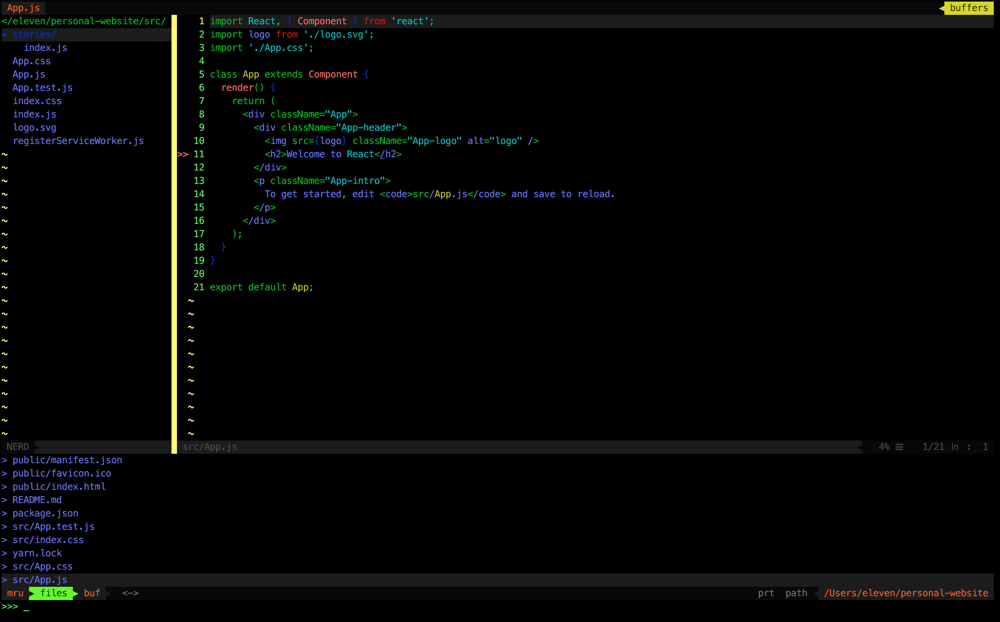

## The vimrc config
It's a beautiful and simple vimrc config for front-end development

## Installation
get the vimrc

    git clone git@github.com:yinone/vim-web.git

copy the config to your .vimrc

    cd vim-web
    cp .vimrc ~/.vimrc

---

